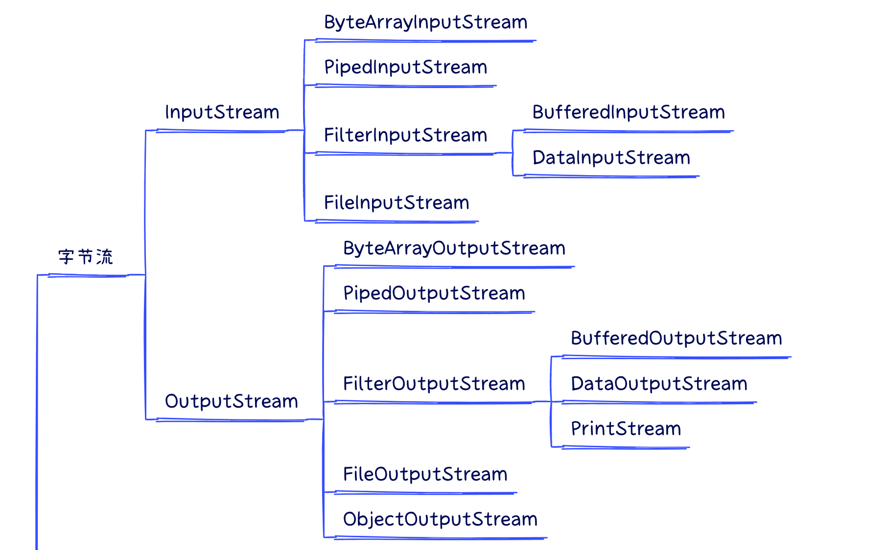
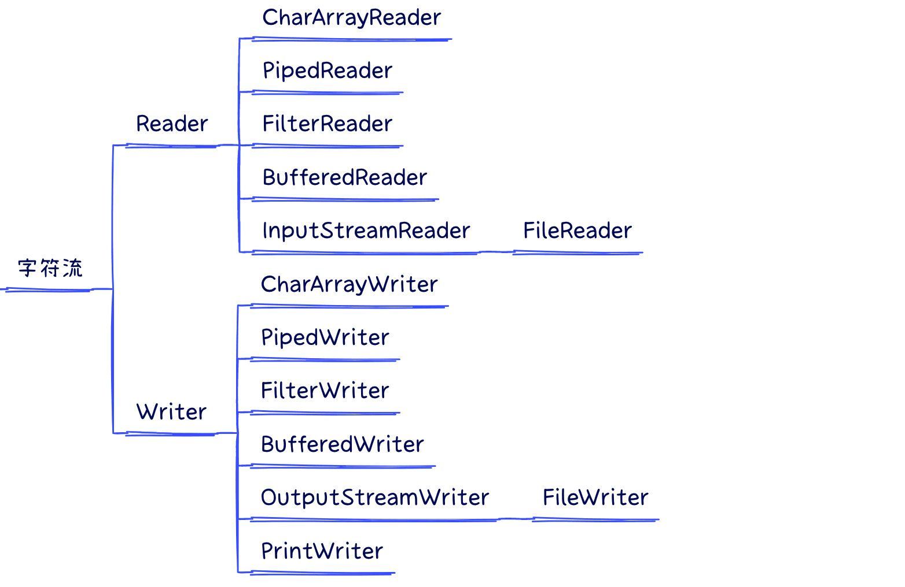
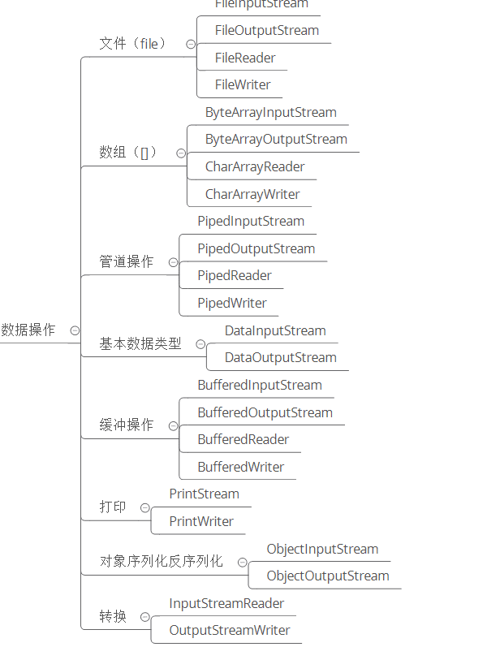
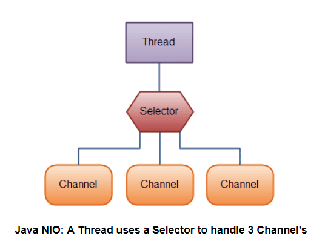

## Java中的IO流如何分类？
| 基类 | 操作单元 | 数据流向 | 常见类 |
| :--: | :--: | :--: | :--: |
| InputStream | 字节流 8位 | 输入流 | FileInputStream
| OutputStream | 字节流 8位 | 输出流 | FileOutputStream
| Reader | 字符流 16位 | 输入流 | FileReader
| Writer | 字符流 16位 | 输出流 | FileWriter

  

## Java的I/O模型分类
- 同步阻塞IO（Blocking IO）：也称为传统的IO模型，它在IO操作过程中会阻塞线程，直到数据完全读取或写入才返回结果。

- 同步非阻塞IO（Non-blocking IO）：使用Java NIO（New IO）库实现的IO模型。在进行IO操作时，线程不会被阻塞，而是立即返回。但是线程仍需要轮询来检查IO操作是否完成，这可能导致CPU资源浪费。

- 多路复用IO（Multiplexing IO）：通过使用Java NIO库中的Selector选择器，一个线程可以同时监听多个通道的IO事件。当某个通道有IO事件发生时，线程会被唤醒处理该事件，其他无事件的通道则会继续监听。

- 信号驱动IO（Signal-driven IO）：使用Java NIO库中的信号机制，让操作系统在IO事件到达时发送信号给应用程序，然后应用程序处理相应的信号。

- 异步IO（Asynchronous IO）：使用Java NIO库中的CompletableFuture或者回调函数等方式实现异步IO。应用程序发起IO操作后，可以继续执行其他任务，当IO操作完成时，会通过回调函数或者Future对象得到通知。

 

## IO与NIO的区别
数据处理方式不同, 前者是面向流的, 后者是面向缓冲区的；前者以流的形式处理数据，后者以块的形式处理数据

 

## NIO的组成
### 通道（Channel）
1. 通道是对IO流的模拟，通过通道进行数据的读取和写入
2. IO流是单向的，而通道的双向的
### 缓冲区（Buffer）
1. 实际上是一个容器，是一个连续数组。 Channel 提供从文件、网络读取数据的渠道，但是读取或写入的数据都必须经由 Buffer
2. 发送给一个通道的所有数据都必须首先放到缓冲区中，同样地，从通道中读取的任何数据都要先读到缓冲区中。也就是说，不会直接对通道进行读写数据，而是要先经过缓冲区。
### 选择器（Selector）

1. NIO 实现了 IO 多路复用中的 Reactor 模型，一个线程 Thread 使用一个选择器 Selector 通过轮询的方式去监听多个通道 Channel 上的事件，从而让一个线程就可以处理多个事件。
2. 通过配置监听的通道 Channel 为非阻塞，那么当 Channel 上的 IO 事件还未到达时，就不会进入阻塞状态一直等待，而是继续轮询其它 Channel，找到 IO 事件已经到达的 Channel 执行。

