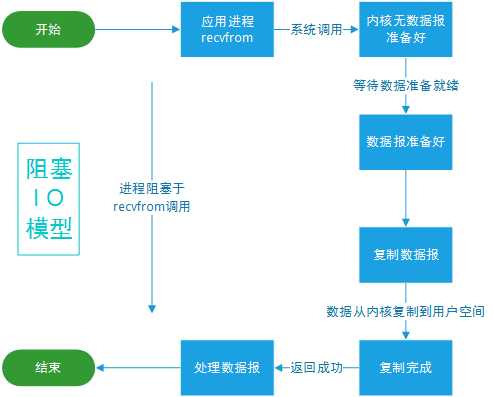
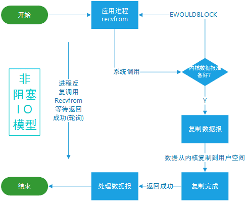
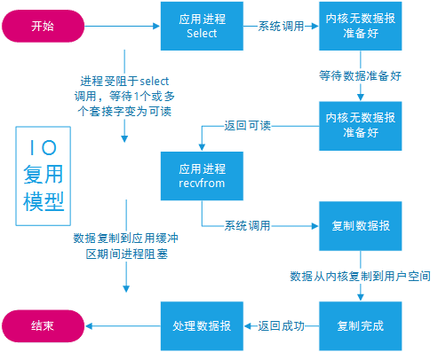
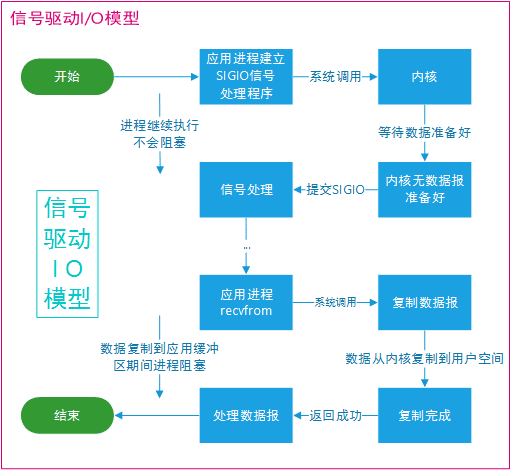
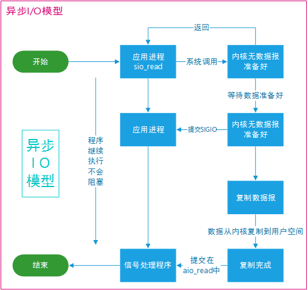
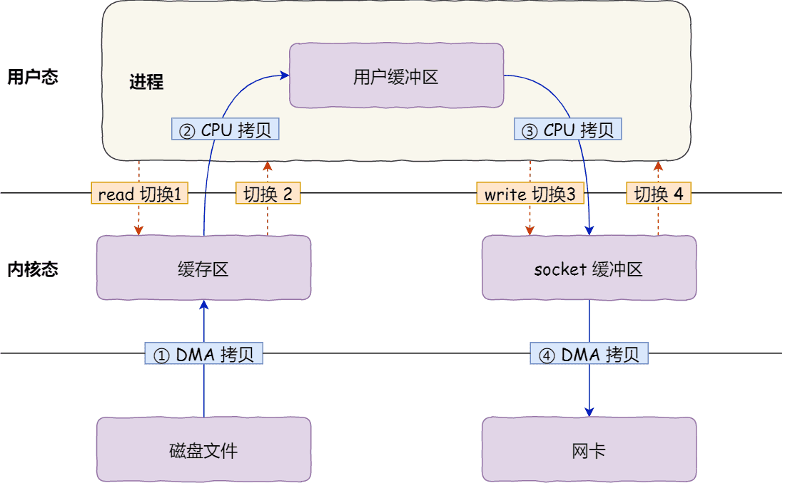
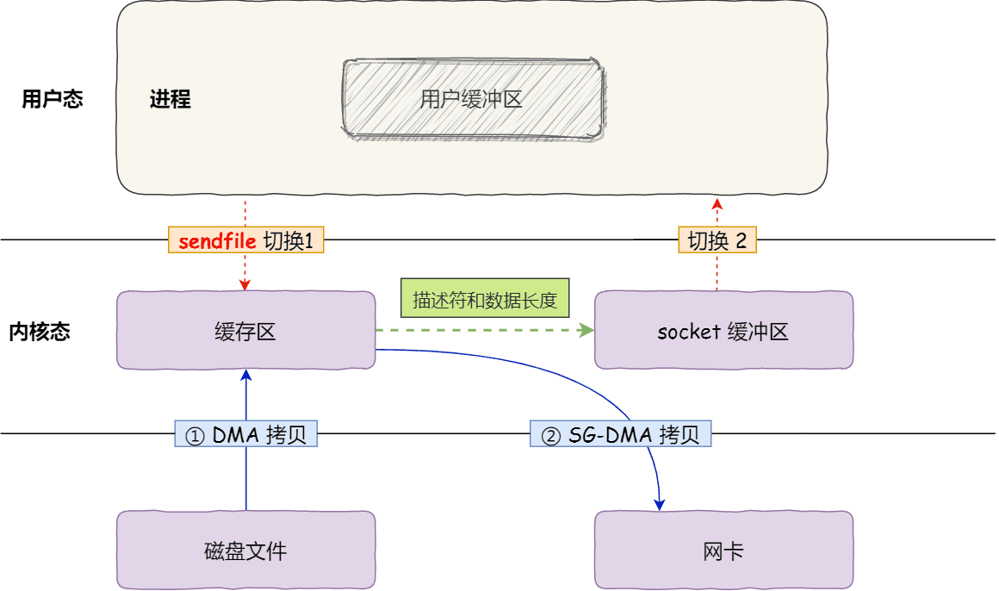

## Java中的IO流如何分类？
| 基类 | 操作单元 | 数据流向 | 常见类 |
| :--: | :--: | :--: | :--: |
| InputStream | 字节流 8位 | 输入流 | FileInputStream
| OutputStream | 字节流 8位 | 输出流 | FileOutputStream
| Reader | 字符流 16位 | 输入流 | FileReader
| Writer | 字符流 16位 | 输出流 | FileWriter

  

## Java的I/O模型分类
- 同步阻塞IO（Blocking IO）：应用进程被阻塞，直到数据复制到应用进程缓冲区中才返回。

- 同步非阻塞IO（Non-blocking IO）：应用进程执行系统调用之后，内核返回一个错误码。应用进程可以继续执行，但是需要不断的执行系统调用来获知 I/O 是否完成，这种方式称为轮询(polling)。

- 多路复用IO（Multiplexing IO）：通过使用Java NIO库中的Selector选择器，一个线程可以同时监听多个通道的IO事件。当某个通道有IO事件发生时，线程会被唤醒处理该事件，其他无事件的通道则会继续监听。

- 信号驱动IO（Signal-driven IO）：应用进程使用 sigaction 系统调用，内核立即返回，应用进程可以继续执行，也就是说等待数据阶段应用进程是非阻塞的。内核在数据到达时向应用进程发送 SIGIO 信号，应用进程收到之后在信号处理程序中调用 recvfrom 将数据从内核复制到应用进程中。

- 异步IO（Asynchronous IO）：相对于同步IO，异步IO不是顺序执行。用户进程进行aio_read系统调用之后，无论内核数据是否准备好，都会直接返回给用户进程，然后用户态进程可以去做别的事情。等到socket数据准备好了，内核直接复制数据给进程，然后从内核向进程发送通知。IO两个阶段，进程都是非阻塞的。

 

## IO与NIO的区别
数据处理方式不同, 前者是面向流的, 后者是面向缓冲区的；前者以流的形式处理数据，后者以块的形式处理数据

 

## NIO的组成
### 通道（Channel）
1. 通道是对IO流的模拟，通过通道进行数据的读取和写入
2. IO流是单向的，而通道的双向的
### 缓冲区（Buffer）
1. 实际上是一个容器，是一个连续数组。 Channel 提供从文件、网络读取数据的渠道，但是读取或写入的数据都必须经由 Buffer
2. 发送给一个通道的所有数据都必须首先放到缓冲区中，同样地，从通道中读取的任何数据都要先读到缓冲区中。也就是说，不会直接对通道进行读写数据，而是要先经过缓冲区。
### 选择器（Selector）

1. NIO 实现了 IO 多路复用中的 Reactor 模型，一个线程 Thread 使用一个选择器 Selector 通过轮询的方式去监听多个通道 Channel 上的事件，从而让一个线程就可以处理多个事件。
2. 通过配置监听的通道 Channel 为非阻塞，那么当 Channel 上的 IO 事件还未到达时，就不会进入阻塞状态一直等待，而是继续轮询其它 Channel，找到 IO 事件已经到达的 Channel 执行。

 

## Reactor模型
### 核心组成部分
- Reactor：负责监听和分配事件，将I/O事件分派给对应的Handler。新的事件包含连接建立就绪、读就绪、写就绪等。
- Acceptor：处理客户端新连接，并分派请求到处理器链中。
- Handler：将自身与事件绑定，执行非阻塞读/写任务，完成channel的读入，完成处理业务逻辑后，负责将结果写出channel。可用资源池来管理。
### Reactor模型分类
- 单Reactor单线程模型：Reactor线程负责多路分离套接字，accept新连接，并分派请求到handler。Redis使用单Reactor单进程的模型。
- 单Reactor多线程模型：hander池化
- 多Reactor多线程模型：主从模型，主Reactor用于响应连接请求，从Reactor用于处理IO请求，读写分离

 

## 零拷贝
### 传统IO

- 发生了四次内核态和用户态的切换：
  - 调用read命令：首先从用户态切换到内核态，当数据从磁盘拷贝到内核态缓冲区后，再有内核态切换到用户态，由CPU将内核态缓冲区的数据拷贝到用户态缓冲区
  - 调用write命令：从用户态切换到内核态，将用户缓冲区内部的数据写入socket缓冲区，写操作完毕后由内核态切换到用户态
- 4 次数据拷贝，其中两次是 DMA 的拷贝，另外两次则是通过 CPU 拷贝的
### 零拷贝的核心思想
减少【用户态和内核态的切换次数】和【内存拷贝次数】
### 零拷贝优化后的IO

- 使用sendfile()指令代替read和write，减少两次用户态和内核态的切换
- 通过DMA将磁盘数据拷贝到内核态缓冲区，并将描述符和数据长度传给Socket缓冲区，这样网卡的SG-DMA可以直接从内核缓冲区将数据拷贝到网卡的数据缓冲区，减少了两次内存拷贝