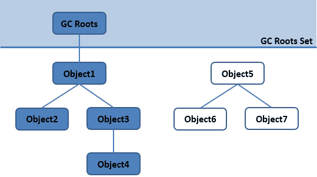
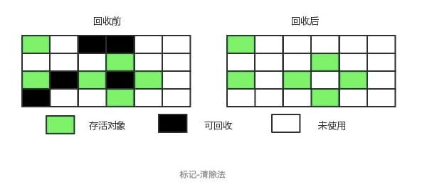

## 内存的分类

- **线程私有**：程序计数器、虚拟机栈、本地方法区
- **线程共享**：堆、方法区, 堆外内存（Java7的永久代或JDK8的元空间、代码缓存）

## 程序计数器
又名程序计数寄存器（Program Counter Register）, JVM中的PCR并不是传统意义上的物理寄存器，而是用于**存储指向下一条指令的地址，即将要执行的指令代码**。由执行引擎读取下一条指令。

- 它是一块很小的内存空间，几乎可以忽略不计。也是运行速度最快的存储区域
- 在 JVM 规范中，每个线程都有它自己的程序计数器，是线程私有的，生命周期与线程的生命周期一致
- 任何时间一个线程都只有一个方法在执行，也就是所谓的**当前方法**。如果当前线程正在执行的是 Java 方法，程序计数器记录的是 JVM 字节码指令地址，如果是执行 native 方法，则是未指定值（undefined）
- 它是程序控制流的指示器，分支、循环、跳转、异常处理、线程恢复等基础功能都需要依赖这个计数器来完成
- 字节码解释器工作时就是通过改变这个计数器的值来选取下一条需要执行的字节码指令
- **它是唯一一个在 JVM 规范中没有规定任何 ****`OutOfMemoryError`**** 情况的区域**

## 虚拟机栈
### 1. 虚拟机栈的存储单位
栈帧（Stack Frame），线程私有，每个线程有独立的栈，当前线程上每一个正在执行的方法，都有私有的栈帧。栈帧保存方法执行过程中的局部变量，执行结果等数据，参与方法的调用和结果返回。

### 2. 虚拟机栈可能出现的问题
Java 虚拟机规范允许 **Java虚拟机栈的大小是动态的或者是固定不变的**
- 如果采用固定大小的 Java 虚拟机栈，那每个线程的 Java 虚拟机栈容量可以在线程创建的时候独立选定。如果线程请求分配的栈容量超过 Java 虚拟机栈允许的最大容量，Java 虚拟机将会抛出一个 **StackOverflowError** 异常
- 如果 Java 虚拟机栈可以动态扩展，并且在尝试扩展的时候无法申请到足够的内存，或者在创建新的线程时没有足够的内存去创建对应的虚拟机栈，那 Java 虚拟机将会抛出一个**OutOfMemoryError**异常

### 3. 栈的运行原理
- 虚拟机栈通过压栈和出栈来实现方法的调用
- 当前正在调用的方法，其对应的栈帧存放于虚拟机栈的顶层，所有指令仅对当前这一个栈帧处理
- 当前方法调用了另一个方法时，则会创建一个新的栈帧，压栈后放在虚拟栈的顶层
- 方法执行结束（Return）或方法内部抛出异常后，当前栈帧会将执行结果返回给下一个栈帧，JVM会舍弃该栈帧并做出栈操作
- 不同虚拟栈之间的栈帧不可相互引用

### 4. 栈帧的内部结构
- 局部变量表：存储方法参数和定义在方法体内的局部变量
- 操作数栈：保存计算过程中的中间结果，并作为计算过程中变量的临时存储空间（本身是栈，1 + 2 这种表达式依次进栈出栈，完成计算）
- 动态链接：每一个栈帧内部都包含一个指向运行时常量池中该栈帧所属方法的引用。
- 方法返回地址：用来存放调用该方法的 PC 寄存器的值（方法返回后需要重新设置调用者栈帧的PCR的值）

## 本地方法栈
本地方法区（Native Method Area）是Java虚拟机（JVM）规范中定义的一部分，它是为了支持JNI（Java Native Interface，即Java本地接口）而设置的。JNI允许Java应用程序通过调用本地代码实现与操作系统或其他语言的交互。
因为本地方法区是为了支持JNI而设置的，所以它只在使用JNI时才会被使用。与Java堆不同的是，本地方法区不是Java虚拟机运行时数据区的一部分，而是属于虚拟机的实现和操作系统的交互部分。

## 堆内存

Java 堆是 Java 虚拟机管理的内存中最大的一块，被所有线程共享。此内存区域的唯一目的就是存放对象实例，几乎所有的对象实例以及数据都在这里分配内存。

### 1. 堆内存的分类
- 新生带（年轻代）：新对象和没达到一定年龄的对象都在新生代
- 老年代（养老区）：被长时间使用的对象，老年代的内存空间应该要比年轻代更大
- 元空间（永久代/非堆区）：像一些方法中的操作临时对象等

#### 新生代
年轻代是所有新对象创建的地方。当填充年轻代时，执行垃圾收集。这种垃圾收集称为 **Minor GC**。年轻一代被分为三个部分——伊甸园（**Eden Memory**）和两个幸存区（**Survivor Memory**，被称为from/to或s0/s1），默认比例是`8:1:1`
- 大多数新创建的对象都位于 Eden 内存空间中
- 当 Eden 空间被对象填充时，执行**Minor GC**，并将所有幸存者对象移动到一个幸存者空间中
- Minor GC 检查幸存者对象，并将它们移动到另一个幸存者空间。所以每次，一个幸存者空间总是空的
- 经过多次 GC 循环后存活下来的对象被移动到老年代。通常，这是通过设置年轻一代对象的年龄阈值来实现的，然后他们才有资格提升到老一代

#### 老年代
旧的一代内存包含那些经过许多轮小型 GC 后仍然存活的对象。通常，垃圾收集是在老年代内存满时执行的。老年代垃圾收集称为 主GC（Major GC），通常需要更长的时间。
大对象直接进入老年代（大对象是指需要大量连续内存空间的对象）。这样做的目的是避免在 Eden 区和两个Survivor 区之间发生大量的内存拷贝

## 方法区/Non-Heap
方法区用于存储已被虚拟机加载的类型信息、常量、静态变量、即时编译器编译后的代码缓存等。

## 类的加载过程
类的加载过程是指将字节码文件（.class文件）中的内容读入内存，并将其转化为能够被JVM执行的Java对象的过程，可以大体上分为三个过程：
1. 加载（Loading）：类加载器通过类名定位到.class文件，并读取二进制数据进入到内存中
2. 链接（Linking）：分为三个小步骤：验证，准备和解析
   - 验证：确保类文件中的二进制数据符合JVM的要求和规范
   - 准备：为类的静态变量分配内存，并赋予初始值
   - 解析：引用替换，字段解析，接口解析，方法解析
3. 初始化（Initialization）：在类的初始化阶段，执行类构造器方法，按照源代码顺序初始化类的静态变量和静态代码块。

## 什么是双亲委派
加载器加载类时，优先交由父类加载器进行加载，父类加载器无法加载则继续向上传递，直到顶层加载器；父类加载器加载成功则返回，否则则由子类加载器自行加载
双亲委派加载机制的优点：
1. 安全。通过这种方式，可以保证Java核心库的类型安全，避免用户自定义的类替代Java核心库中的类，从而防止恶意行为。
2. 避免重复加载。通过这种方式，可以保证不会重复加载同一个类，因为每一个类只会被它的定义类加载器或者其祖先类加载器所加载。

## 什么是可达性分析
通过 GC Roots 作为起始点进行搜索，能够到达到的对象都是存活的，不可达的对象可被回收。对象与对象之间的【可达】特性指的是对象之间的引用。

## Java中有哪些引用类型
- 强引用：把一个对象赋给一个引用变量，这个引用变量就是一个强引用。当一个对象被强引用变量引用时，它处于可达状态，它是**不可能被垃圾回收机制回收的**，即使该对象以后永远都不会被用到 JVM 也不会回收。因此强引用是造成 Java 内存泄漏的主要原因之一。
- 软引用：软引用需要用 SoftReference 类来实现，对于只有软引用的对象来说，当系统内存足够时它不会被回收，**当系统内存空间不足时它会被回收**。软引用通常用在对内存敏感的程序中。
- 软引用：弱引用需要用 WeakReference 类来实现，它比软引用的生存期更短，对于只有弱引用的对象来说，__只要垃圾回收机制一运行，不管 JVM 的内存空间是否足够，总会回收该对象占用的内存__。
- 虚引用：虚引用需要 PhantomReference 类来实现，它不能单独使用，必须和引用队列联合使用。 虚引用的主要作用是—__跟踪对象被垃圾回收的状态__。

## 讲一讲垃圾回收算法
垃圾回收算法有下面四种：
1. __标记-清除算法__
标记清除算法是将内存块中处于活动状态的对象（及满足可达性分析）标记一遍，然后删除没有被标记的对象
优点：算法简单易懂
缺点：容易产生内存碎片

2. __复制算法__
复制算法是将内存分为两块，正常对象存储集中在其中一块内存上，当这一块内存占满后，将该块内存上活动的对象复制到另一块内存中，并清空之前内存块中的所有对象。
优点：没有内存碎片
缺点：浪费了一半内存

3. __标记-整理算法__
和标记清除算法类似，先标记内存中活动的对象，并将被标记对象移动到内存的一边，直接清理掉内存另一端的对象。
优点：避免内存碎片
缺点：整理操作需要时间

4. 分代收集法
新生代使用复制算法，老年代使用标记-整理算法

