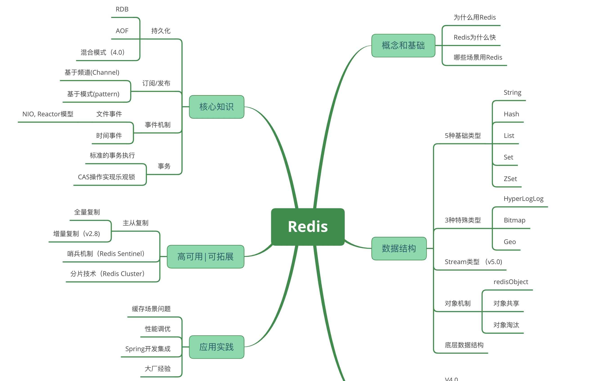

## 什么是Redis
Redis是一款内存高速缓存数据库。Redis全称为：Remote Dictionary Server（远程数据服务），使用C语言编写，Redis是一个key-value存储系统（键值存储系统）

 

## Redis的优势
- 高性能：Redis完全基于内存操作，因此具有非常高的读写速度。相比传统的磁盘数据库，Redis可以实现更低的延迟和更高的吞吐量。

- 数据结构丰富：Redis支持多种数据结构，包括字符串、列表、哈希表、集合、有序集合等。这些数据结构使得开发人员可以更方便地处理复杂的数据需求，并在内存中进行高效的操作。

- 持久化支持：Redis提供了两种持久化机制，即快照（snapshotting）和日志（append-only file）。这样可以确保即使在服务器重启或崩溃时，数据也能够安全地保存。

- 高可用性：Redis支持主从复制和sentinel机制，可以实现数据的自动备份和故障恢复。当主节点发生故障时，Redis可以自动将一个从节点晋升为新的主节点，从而保证系统的高可用性。

- 发布/订阅功能：Redis提供了发布/订阅模式，允许开发人员在应用程序之间进行实时消息传递。这对于构建实时通信、消息队列和事件驱动的应用程序非常有用。

- 缓存功能：由于Redis具有高性能和丰富的数据结构，它被广泛用作缓存层。通过将常用的数据存储在Redis中，可以显著提高应用程序的响应速度和吞吐量。

- 存储容量：单个字符串最大存储容量为512MB

 

## Redis的数据结构
### 5种基础数据结构

- string
- hash
- list
- set
- sorted set
### 3种特殊数据结构
- HyperLogLogs（基数统计）
- Bitmap （位存储）
- geospatial (地理位置)
### 底层数据结构
- 简单动态字符串 sds
- 压缩列表 ZipList
- 快表 QuickList
- 字典/哈希表 Dict
- 整数集 IntSet
- 跳表

 

## Redis的Hash类型数据的内部实现？如何存储？如何解决Hash冲突？
- Redis的hash数据类型是一个字典（dictionary）结构。在内部实现上，Redis的hash数据类型使用了哈希表（hash table）来存储键值对。
- Redis的哈希表使用了一种开放定址法的线性探测来解决哈希冲突。每个哈希表的槽位中存储了一个指向键值对的指针，当发生哈希冲突时，会通过线性探测的方式寻找下一个可用的槽位。

 

## Redis的Hash表什么时候会扩容？
当Hash表的负载因子（存储元素的数量与哈希槽数量的比例）超过阈值会触发扩容，哈希槽为16384个，每一个key经过CRC16校验后，对16384取模确定存在哪一个哈希槽里，集群的每个节点负责一部分hash槽。

 

## Redis线程模型
- 基于事件驱动：Redis使用事件驱动的方式来处理网络事件，如客户端连接、数据读写等。它通过一个事件循环监听和处理这些事件。当有事件发生时，Redis会调用相应的处理函数来处理该事件。这种事件驱动的方式使得Redis能够高效地处理大量的并发请求。

- 非阻塞IO：Redis使用非阻塞IO来处理网络数据的读写。当有数据需要读取或写入时，Redis会尝试进行非阻塞的操作。如果操作成功，则立即处理数据；如果操作失败，则将数据放入一个队列中，等待后续处理。通过使用非阻塞IO，Redis能够同时处理多个客户端请求，并提高系统的吞吐量。

- 多路复用：Redis使用多路复用技术来管理多个网络连接。它通过一个主线程监听多个连接，并将事件通知给相应的处理函数。这种多路复用的方式能够避免创建大量的线程来处理连接，从而节省系统资源。
 

## 单线程的Redis为什么快
- 纯内存操作
- 单线程操作，避免了频繁的上下文切换，避免了与锁相关的问题（加锁，释放锁，死锁）
- 采用了非阻塞I/O多路复用机制

 

## 持久化
### 为什么需要持久化
Redis的存储是基于内存的，一旦运行Redis的机器宕机，就会造成数据缺失，只能从后端数据库进行数据恢复，而后端数据库存在性能瓶颈，在面对大数据场景下会导致服务响应问题，因此需要Redis持久化.
### RDB持久化方式
- 原理：使用快照的形式半持久化记录Redis中的所有键值对信息，主线程fork()一个子进程，将当前父进程的数据库数据复制到子进程的内存中（fork时复制的是父进程的页表，即虚拟内存和物理内存的应映射关系；在这个过程中主进程新写入的数据将会被子进程直接复制物理内存），然后由子进程写入到临时文件中，持久化结束后替换上一次的快照文件，存入磁盘内
- 优点：
  - 容灾性好：全局只有一个持久化文件，方便压缩并转移到其他存储介质上，二进制的数据，占用内存更小，更紧凑，更适合做为备份文件
  - 性能最大化：fork子进程进行持久化，不会阻塞主进程的任务，IO最大化
  - 重启效率更高：与AOF格式文件相比，RDB文件的重启效率更高
- 缺点：
  - RDB是周期性持久化方式，如果最后一次RDB持久化后Redis崩溃，则崩溃之后产生的数据都会丢失
  - RDB通过fork子进程进行持久化，系统开销较大，如果数据集较大同时会导致fork操作时间过长
- 触发方式：
  - 手动：执行save命令（堵塞主进程）或bgsave命令（fork子进行进行快照持久化）
  - 自动：主从复制或m秒内有n次修改
### AOF持久化方式
- 原理：
  - Redis服务器将每个写操作以协议格式追加到AOF文件中（先写入内存，再写入AOF_buff，最后同步到AOF文件里）。
  - AOF文件保存了完整的Redis操作日志，以文本形式记录了所有对Redis的写操作。
  - 当Redis重新启动时，它会通过重新执行AOF文件中保存的所有写操作来恢复数据。
- 优点：
  - 持久化：AOF提供了持久化存储机制，确保数据在服务器重启后不会丢失。
  - 可读性：AOF文件保存了Redis操作的完整日志，易于阅读和分析。
  - 安全性：AOF采用追加方式记录写操作，不会覆盖之前的数据，因此可以保护数据免受意外的损坏或数据丢失。
- 缺点：
  - 文件大小：由于AOF文件记录了所有写操作，随着时间的推移，文件的大小会不断增长，可能导致占用大量磁盘空间。
  - 写性能：相比于快照持久化方式，AOF的写入性能通常较差，因为需要频繁地将写操作追加到文件末尾。
  - 恢复时间：当AOF文件过大时，Redis重新启动时需要执行的写操作较多，可能导致恢复时间较长。
> 混合使用 AOF 日志和内存快照的方法：内存快照以一定的频率执行，在两次快照之间，使用 AOF 日志记录这期间的所有命令操作。

 

## 发布订阅模式
Redis发布订阅使用了发布/订阅模型。当有新消息发布到频道时，Redis会将该消息发送给所有订阅了该频道的客户端。
Redis的发布订阅机制是一种无保证的消息传递方式。也就是说，当有新消息发布时，Redis会尽最大努力将消息发送给订阅者，但在某些情况下（例如网络故障），消息可能会丢失。

 

## 过期键删除策略
- 定时删除:在设置键的过期时间的同时，创建一个定时器， 让定时器在键的过期时间来临时，立即执行对键的删除操作。
- 惰性删除:放任键过期不管，但是每次从键空间中获取键时，都检查取得的键是否过期，如果过期的话，就删除该键;如果没有过期，就返回该键。
- 定期删除:每隔一段时间程序就对数据库进行一次检查，删除里面的过期键。

 

## 内存淘汰算法
- Noeviction（不淘汰）：这是默认的淘汰策略，当内存不足以容纳新数据时，写操作会报错，指示内存溢出。
- Allkeys-lru（最近最少使用）：在所有键中，LRU算法选择最近最少被访问的键，并删除它们。这是最常用的淘汰策略。
- Volatile-lru（带过期时间键的最近最少使用）：只对设置了过期时间的键进行LRU淘汰。
- Allkeys-random（随机删除）：在所有键中，随机选择一些键进行删除。
- Volatile-random（带过期时间键的随机删除）：只对设置了过期时间的键进行随机删除。
- Volatile-ttl（带过期时间键的TTL淘汰）：根据键的剩余生存时间（TTL）进行淘汰，较早过期的键优先删除。

 

## Redis事务
redis事务就是一次性、顺序性、排他性的执行一个队列中的一系列命令；
基本思想是将一系列的命令打包成一个单独的操作单元，然后一次性地将这个操作单元提交给服务器执行。在事务执行期间，服务器会按照顺序执行事务中的各个命令，并在事务执行完成后返回结果。 

Redis事务使用下列指令：
- MULTI ：开启事务，redis会将后续的命令逐个放入队列中
- EXEC：执行事务中的所有操作命令
- DISCARD：取消事务，放弃执行事务块中的所有命令
- WATCH：监视一个或多个key,如果事务在执行前，这个key(或多个key)被其他命令修改，则事务被中断，不会执行事务中的任何命令。
- UNWATCH：取消WATCH对所有key的监视。

 

## Redis事件
### 有哪些事件类型？
- 可读事件（Read Event）：当一个文件描述符可读时触发。
- 可写事件（Write Event）：当一个文件描述符可写时触发。
- 时间事件（Time Event）：基于时间触发的事件，用于执行定时任务。
- 连接事件（Connection Event）：当有新的客户端连接或断开连接时触发。
### 

 

## 主从复制机制
### 全量复制阶段
主节点会执行一个保存操作，将当前数据库状态保存到磁盘上的RDB文件中，并将该文件发送给从节点。从节点接收到RDB文件后，会将其加载到自己的内存中，使得从节点的数据与主节点保持一致。
### 增量复制阶段
全量复制阶段之后，主节点会将自己执行的写操作以命令的形式发送给从节点。从节点接收到命令后，会按照相同的顺序执行这些命令，从而保持与主节点的数据一致性。主节点会周期性地将自己执行的写操作发送给从节点，以保证数据的实时同步。
> 在主从复制模型中，主节点负责接收客户端的写请求，并将写操作同步给所有的从节点。从节点只能接收客户端的读请求，不能直接处理写请求。这样的设计可以分担主节点的负载，同时实现数据冗余和高可用性。
需要注意的是，Redis的主从复制模型是异步的，即主节点将写操作发送给从节点后并不等待从节点的响应。因此，在某些情况下，主节点与从节点之间的数据可能出现短暂的不一致。但是，通过合理的配置和监控，可以保证数据的最终一致性。

 

## 哨兵机制
- 监控（Monitoring）：哨兵会不断地检查主节点和从节点是否运作正常。
- 自动故障转移（Automatic failover）：当主节点不能正常工作时，哨兵会开始自动故障转移操作，它会将失效主节点的其中一个从节点升级为新的主节点，并让其他从节点改为复制新的主节点。
- 配置提供者（Configuration provider）：客户端在初始化时，通过连接哨兵来获得当前Redis服务的主节点地址。
- 通知（Notification）：哨兵可以将故障转移的结果发送给客户端。
### 哨兵集群如何建立
每一个节点将自己的IP地址发布到频道上，其他节点订阅这个频道，互相可以知晓对方的IP地址
### 哨兵如何判断主库是否下线
每一个哨兵节点可以通过对主库的监控探测主观认为主库已经下线，哨兵集群内部对当前节点对于主库下线的观点做出回应，正向回应超过一定阈值则判断主库已下线

 

## Redis集群模式（分片机制）
Redis 集群架构是支持单节点单机模式的，也支持一主多从的主从结构，还支持带有哨兵的集群部署模式。
 Redis 集群并没有使用一致性 hash，而是引入了哈希槽的概念。Redis 集群有16384（2^14）个哈希槽，每个 key 通过 CRC16 校验后对 16384 取模来决定放置哪个槽，集群的每个节点负责一部分hash 槽。
### 为什么是16384

 

## 缓存问题
### 缓存雪崩
#### 引发原因
指在缓存中存储的大量键同时失效或过期，导致大量请求直接访问后端数据库或应用程序，从而造成数据库压力剧增、性能下降甚至宕机的情况
#### 解决方案
- 设置合理的过期时间：为了防止缓存键同时失效，可以设置不同的过期时间，避免大量键在同一时间点过期。可以引入随机值或在过期时间上添加一个偏移量来分散过期时间。
- 实施缓存失效的分布：将缓存的失效时间分布在不同时间段，避免全部键在同一时间点失效。可以使用定时任务或者自动刷新机制来实现。
- 实施限流和降级策略：当缓存失效时，如果直接请求后端数据库会造成压力过大，可以采取限流和降级策略，例如通过控制请求的并发数或者返回默认值等方式进行处理。
- 数据预加载：提前加载热门数据到缓存中，避免在高并发情况下对后端数据库的直接访问，减轻数据库压力。

### 缓存穿透
#### 引发原因
在使用Redis作为缓存时，恶意或者异常请求导致缓存失效，从而绕过了缓存层而直接访问后端存储系统（如数据库），造成数据库压力过大。
#### 解决方案
- 布隆过滤器（Bloom Filter）：布隆过滤器可以用于快速判断一个元素是否存在于集合中。在查询前，先通过布隆过滤器判断请求的数据是否一定不存在，如果被过滤掉则可以直接返回，避免对数据库的查询操作。
- 空值缓存：针对不存在的数据，可以将其缓存为空值，即使后续请求查询该数据，也可以直接返回空值

### 缓存预热
#### 原理
指在系统启动或者缓存失效之前，提前将一些常用的数据加载到缓存中，以避免在实际请求中发生缓存穿透或者高并发请求直接访问数据库的情况。通过缓存预热，可以提高系统的性能和响应速度。
#### 预热方案
- 批量加载：通过脚本、工具或者自定义的业务逻辑，将预热的数据批量加载到Redis缓存中。可以从数据库或者其他数据源中读取数据，并将其存储到缓存中。
- 延迟加载：在系统启动的初期，不立即加载所有数据到缓存中，而是根据请求的频率和优先级，按需加载数据。
- 定时刷新：在预设的时间间隔内，定时触发缓存数据的刷新操作，保持缓存中的数据与后端存储系统的一致性。这样可以避免缓存数据过期而导致的缓存穿透问题。

### 缓存降级

