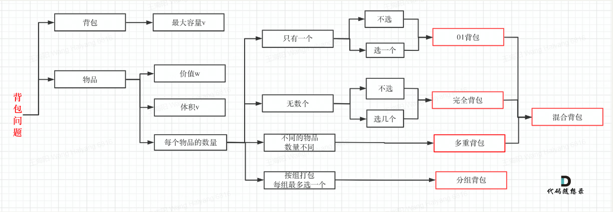

# 背包问题

## 目录

- [背包问题](#背包问题)
  - [目录](#目录)
  - [1. 物品的价值是哪一个属性](#1-物品的价值是哪一个属性)
  - [2. 物品的重量是哪一个属性](#2-物品的重量是哪一个属性)
  - [3. 背包容量是哪一个属性](#3-背包容量是哪一个属性)
  - [4. 物品是只能取一次还是可以多次获取](#4-物品是只能取一次还是可以多次获取)
  - [01背包](#01背包)
    - [确定dp数组（dp table）以及下标的含义](#确定dp数组dp-table以及下标的含义)
    - [确定递推公式](#确定递推公式)
    - [dp数组如何初始化](#dp数组如何初始化)
    - [确定遍历顺序](#确定遍历顺序)
    - [举例推导dp数组](#举例推导dp数组)
  - [完全背包](#完全背包)



## 1. 物品的价值是哪一个属性

## 2. 物品的重量是哪一个属性

## 3. 背包容量是哪一个属性

## 4. 物品是只能取一次还是可以多次获取

## 01背包

有N件物品和一个最多能被重量为W 的背包。第i件物品的重量是weight\[i]，得到的价值是value\[i] 。每件物品只能用一次，求解将哪些物品装入背包里物品价值总和最大。

### 确定dp数组（dp table）以及下标的含义

有两个维度的选择，所以使用二维数组

dp\[i]\[j]表示从下标为0 - i 的物品里任意选择，放入容量为j的背包里，能够获得的最大价值

### 确定递推公式

dp\[i]\[j] 可以由两个方式计算获得，因为dp\[i]\[j]指代的是最大值，也就是对i进行选择后，不能再放入其他物品

1.  放入第i个物品，背包正好放满。背包为j-weight\[i] 时，在i-1个物品中任意选择获得的最大值 加上value\[i]
2.  不放入第i个物品。此时最大值就是dp\[i-1]\[j]

对上面两种情况获得的值取较大者

dp\[i]\[j] = max(dp\[i-1]\[j-weight\[i]] + value\[i], dp\[i-1]\[j])

### dp数组如何初始化

对第一行和第一列进行初始化

第一行：背包容量从0-W，仅放第一个物品，当容量小于weight\[0]时，dp\[0]\[j] = 0；当容量可以放下第一个物品时，dp\[0]\[j] = value\[0]

第一列：背包容量为0时，放不下任意一个物品，因此dp\[i]\[0]始终为0（可以省略这一步）

### 确定遍历顺序

先遍历物品，再遍历背包容量

```java
for(int i = 1;i < N;i++){
  for(int j = weight[i];j <= W;j++){
    dp[i][j] = max(dp[i-1][j-weight[i]] + value[i], dp[i-1][j]);
  }
}
```

### 举例推导dp数组

也可以使用一维数组

```java
for(int i = 0; i < weight.size(); i++) { // 遍历物品        
  for(int j = bagWeight; j >= weight[i]; j--) { // 遍历背包容量            
    dp[j] = max(dp[j], dp[j - weight[i]] + value[i]);        
  }    
}

```

## 完全背包

有N件物品和一个最多能背重量为W的背包。第i件物品的重量是weight\[i]，得到的价值是value\[i] 。每件物品都有无限个（也就是可以放入背包多次），求解将哪些物品装入背包里物品价值总和最大。

01背包内嵌的循环是从大到小遍历，为了保证每个物品仅被添加一次。而完全背包的物品是可以添加多次的，所以要从小到大去遍历

```java
for(int i = 0; i < weight.size(); i++) { // 遍历物品        
  for(int j = weight[i]; j <= bagWeight; j--) { // 遍历背包容量            
    dp[j] = max(dp[j], dp[j - weight[i]] + value[i]);        
  }    
}
```

> 📌在求装满背包有几种方案的时候，认清遍历顺序是非常关键的。

> 📌如果求组合数就是外层for循环遍历物品，内层for遍历背包。

> 📌如果求排列数就是外层for遍历背包，内层for循环遍历物品。

[416. 分割等和子集](1.%20分割等和子集.md "416. 分割等和子集")

[1049. 最后一块石头的重量 II](2.%20最后一块石头的重量.md "1049. 最后一块石头的重量 II")

[494. 目标和](3.%20目标和.md "494. 目标和")

[474. 一和零](4.%20一和零.md "474. 一和零")

[518. 零钱兑换 II](5.%20零钱兑换Ⅱ.md "518. 零钱兑换 II")

[377. 组合总和 Ⅳ](6.%20组合总和Ⅳ.md "377. 组合总和 Ⅳ")

[322. 零钱兑换](7.%20零钱兑换.md "322. 零钱兑换")

[279. 完全平方数](8.%20完全平方数.md "279. 完全平方数")

[139.单词拆分](9.%20单词拆分.md "139.单词拆分")
